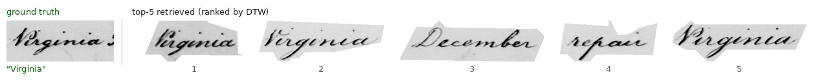
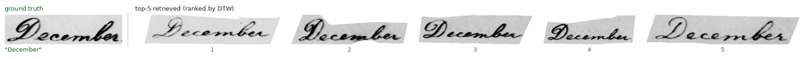
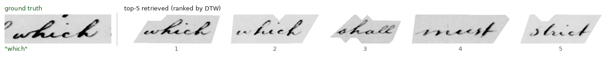

# Keyword Spotting in Historical Documents (DTW)

A **learning-free keyword-spotting (KWS)** system that retrieves handwritten words from historical document images by *visual similarity* — without transcribing them. Given a query keyword, it finds the word images in the collection that look most like it, which is valuable for historical manuscripts where OCR and manual transcription are unreliable.

|              |                                                                        |
|--------------|------------------------------------------------------------------------|
| **Course**   | Pattern Recognition — University of Fribourg (BeNeFri joint MSc)        |
| **Dataset**  | George Washington (handwritten historical documents)                   |
| **Method**   | Sliding-window features + Dynamic Time Warping (no training)           |
| **Type**     | Group project (Group 10), 2025                                         |
| **Result**   | Mean Average Precision ≈ **0.27**, precision@1 ≈ **0.64**             |

---

## How it works

A classical pattern-recognition pipeline, with no trained model:

1. **Word extraction** — crop each word from the page using the provided polygon annotations (SVG bounding boxes in `locations/`).
2. **Preprocessing** — greyscale, **Otsu binarisation**, and height normalisation to a fixed size.
3. **Feature extraction** — a **sliding-window** column descriptor scans the word left-to-right, producing a 7-dimensional feature vector per column (intensity, transition counts, upper/lower profiles, pixel density, stroke thickness). A word thus becomes a variable-length sequence.
4. **Sequence comparison** — **Dynamic Time Warping (DTW)** measures the dissimilarity between a keyword template and each candidate word, aligning sequences of different widths. A **Sakoe–Chiba band** constrains the warping path and speeds up the computation.
5. **Ranking** — for each keyword, candidates are ranked by ascending DTW dissimilarity and mapped to a 0–100 score.
6. **Evaluation** — standard KWS metrics: **mean Average Precision (mAP)** and precision/recall at top-k.

---

## Results

On the test set the system reaches **AP ≈ 0.27** — a reasonable score for a learning-free DTW approach on difficult historical handwriting.

| Top-k | Precision | Recall |
|:-----:|:---------:|:------:|
| 1     | 0.643     | 0.101  |
| 2     | 0.557     | 0.175  |
| 3     | 0.457     | 0.215  |
| 5     | 0.343     | 0.269  |

Precision is high at rank 1 (the single closest match is correct ~64% of the time) and trades off against recall as more results are returned — the expected behaviour for ranked retrieval. The full write-up is in `KWS-Exercise3-Report.pdf`.

The best configuration used the **`train_val` reference strategy**; that run is kept in the repo (`submission_train_val.csv` and its per-keyword visualisations in `analysis_images_train_val/`). See [Reproducing the best submission](#reproducing-the-best-submission).

### Retrieval examples

Each row shows a genuine instance of the query word taken from the **training set** (ground truth, left) next to the **top-5 word images the system retrieved** from the unseen test pages, ranked 1–5 by DTW dissimilarity. The system is matching on *shape alone* — it has no access to the transcription.







The retrieved words clearly track the visual form of the query — length, ascenders/descenders and overall stroke pattern — which is exactly what a DTW-over-column-features approach keys on. Harder cases fail when different words share a similar silhouette or when the same word is written very differently, which is what pulls the mean Average Precision down to ~0.27.

---

## Getting started

**Requirements:** Python 3 with `numpy`, `pillow`, `matplotlib`, and `tqdm`. (DTW and the sliding-window features are implemented directly, not pulled from a library.)

**Run the pipeline:**

```bash
# Build the feature cache (first run) and produce a ranked submission
python3 kws.py --out submission.csv

# Score a submission and print the metrics
python3 analyze_submission.py --submission submission.csv
```

The first run extracts features from every word image and writes a cache (`features_cache.pkl`); later runs reuse it (pass `--force` to rebuild). `kws.py` is configurable via a rich CLI — DTW band width, resize dimensions, feature smoothing, reference-selection strategy, score-normalisation mode, and multi-threaded DTW.

### Reproducing the best submission

The **`train_val`** strategy pools *every* instance of a keyword from both the training and validation sets as reference templates (rather than a single example), and scores each test word by its aggregated DTW dissimilarity to them — which makes matching more robust to the natural variation in handwriting. It was the best of the strategies tried (`val`, `train_val`, `best_on_val`, `rank_frac`, …).

```bash
# 1. Build the ranked submission with the train_val reference strategy.
#    Remaining settings are the pipeline defaults: DTW band = 10, words resized
#    to 150x150, references aggregated by average, scores mapped with 'ap' mode.
python3 kws.py --ref-select train_val --out submission_train_val.csv

# 2. Score it and render the per-keyword retrieval visualisations.
python3 analyze_submission.py \
        --submission submission_train_val.csv \
        --copy-images analysis_images_train_val
```

Step 2 computes the metrics above and copies, for each keyword, the top-ranked retrieved word images into `analysis_images_train_val/` so the matches can be inspected by eye.

---

## Project structure

```
.
├── kws.py                      # main KWS pipeline (feature caching, DTW scoring, submission)
├── utils.py                    # shared helpers (I/O, image handling, metrics)
├── analyze_submission.py       # evaluation / metrics + retrieval visualisations
├── diagnose_dissimilarities.py # debugging tool: renders top matches per keyword
│
├── images/ · images-test-set/          # George Washington page images        (provided)
├── locations/ · locations-test-set/    # per-word polygon annotations (SVG)    (provided)
├── *.tsv                               # transcriptions, keywords, train/val/test splits (provided)
├── sample-submission.csv              # submission format template            (provided)
│
├── submission_train_val.csv    # best run (train_val strategy)        — kept as final result
├── analysis_images_train_val/  # retrieval visualisations for that run — kept as final result
│
├── KWS-Exercise3-Report.pdf    # written report and analysis
└── Exercise-3.pdf              # assignment brief
```

Generated artefacts — the feature cache, other experimental submissions, evaluation CSVs and diagnostic images — are not tracked (see `.gitignore`); only the single best submission and its visualisations are kept, as a record of the final result.

---

## Notes

Group project (Group 10). The George Washington dataset and the assignment brief were provided by the course; the pipeline (`kws.py`, `utils.py`) and analysis tooling are the group's own work. Master's-level coursework at the University of Fribourg.